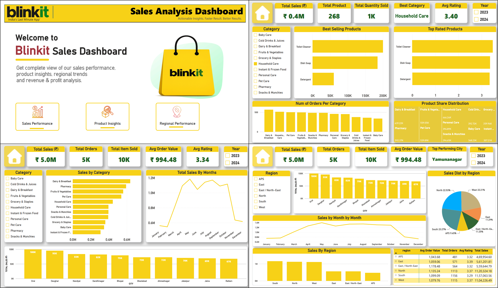

# 🛒 Blinkit Sales Analysis Dashboard

<p align="center">
  
</p>

---

## 📌 Overview

An interactive **Power BI Dashboard** built using the Blinkit Sales Dataset to analyze sales performance, product insights, and regional trends through dynamic visualizations and KPIs.

### 🎯 Objectives

- Analyze sales performance
- Identify best-selling products
- Explore regional trends
- Compare category performance
- Build an interactive business dashboard

---

## 🚀 Tech Stack

- Microsoft Power BI
- Power Query
- DAX
- Data Modeling
- Data Visualization

---

## 📊 Dashboard Features

### 📈 Sales Performance
- Total Sales
- Total Orders
- Total Items Sold
- Average Order Value
- Average Rating
- Sales by Category
- Monthly Sales Trend
- Top 10 Cities

### 📦 Product Insights
- Best Selling Products
- Top Rated Products
- Product Share Distribution
- Orders by Category
- Best Category

### 🌍 Regional Performance
- Region-wise Sales
- Sales Distribution
- Region KPI Matrix
- Monthly Sales Trend
- Top Performing City

---

## ✨ Key Features

- Interactive Filters & Slicers
- Dynamic KPI Cards
- Responsive Dashboard Design
- Drill-down Analysis
- Business-Oriented Insights
- Blinkit-inspired Theme

---

## 📂 Repository Structure

```text
Blinkit-Sales-Dashboard/
│
├── Blinkit Dashboard.pbix
├── Blinkit Dashboard.pdf
├── README.md
└── blinkit_readme_assets/
    ├── dashboard_preview.png
```

---

## 📥 Getting Started

1. Clone the repository

```bash
git clone https://github.com/yourusername/Blinkit-Sales-Dashboard.git
```

2. Open `Blinkit Dashboard.pbix` in Power BI Desktop.

3. Explore the dashboard using the available slicers and filters.

---

## 📌 Business Insights

- Sales performance can be analyzed across multiple categories.
- Product Insights identify best-selling and highest-rated products.
- Regional analysis highlights top-performing cities and regions.
- Monthly trends help identify seasonal sales patterns.
- Interactive slicers enable dynamic exploration of the data.

---

## 👨‍💻 Author

**Prince Saxena**

- GitHub: https://github.com/Prince-Saxena
- LinkedIn: https://linkedin.com/in/prince-saxena1/

---

⭐ If you found this project useful, consider giving it a star.
